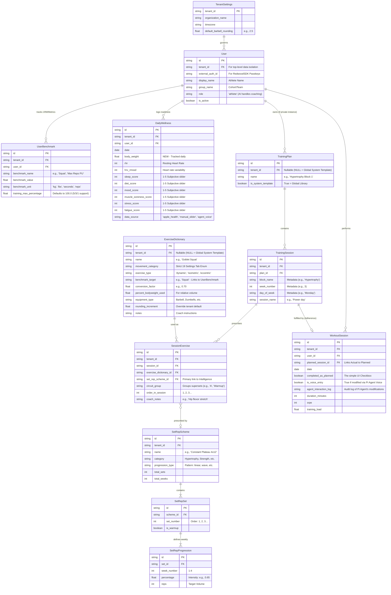

```mermaid
erDiagram
    TenantSettings ||--o{ User : "governs"
    User ||--o{ UserBenchmark : "tracks 1RM/Metrics"
    User ||--o{ DailyWellness : "logs readiness"
    User ||--o{ TrainingPlan : "owns (if private instance)"
    User ||--o{ WorkoutSession : "performs"

    ExerciseDictionary ||--o{ SessionExercise : "used as"

    TrainingPlan ||--o{ TrainingSession : "contains"
    TrainingSession ||--o{ SessionExercise : "prescribes"
    TrainingSession ||--o| WorkoutSession : "fulfilled by (Adherence)"

    %% Set & Rep Scheme Relationships
    SessionExercise }o--o| SetRepScheme : "prescribed by"
    SetRepScheme ||--|{ SetRepSet : "contains"
    SetRepSet ||--|{ SetRepProgression : "defines weekly"

    TenantSettings {
        string tenant_id PK
        string organization_name
        string timezone
        float default_barbell_rounding "e.g., 2.5"
    }

    User {
        string id PK
        string tenant_id FK "For top-level data isolation"
        string external_auth_id "For RedwoodSDK Passkeys"
        string display_name "Athlete Name"
        string group_name "Cohort/Team"
        string role "'athlete' (AI handles coaching)"
        boolean is_active
    }

    DailyWellness {
        string id PK
        string tenant_id FK
        string user_id FK
        date date
        float body_weight "NEW - Tracked daily"
        int rhr "Resting Heart Rate"
        int hrv_rmssd "Heart rate variability"
        int sleep_score "1-5 Subjective slider"
        int diet_score "1-5 Subjective slider"
        int mood_score "1-5 Subjective slider"
        int muscle_soreness_score "1-5 Subjective slider"
        int stress_score "1-5 Subjective slider"
        int fatigue_score "1-5 Subjective slider"
        string data_source "'apple_health', 'manual_slider', 'agent_voice'"
    }

    UserBenchmark {
        string id PK
        string tenant_id FK
        string user_id FK
        string benchmark_name "e.g., 'Squat', 'Max Reps PU'"
        float benchmark_value
        string benchmark_unit "'kg', 'lbs', 'seconds', 'reps'"
        float training_max_percentage "Defaults to 100.0 (5/3/1 support)"
    }

    ExerciseDictionary {
        string id PK
        string tenant_id FK "Nullable (NULL = Global System Template)"
        string name "e.g., 'Goblet Squat'"
        string movement_category "Strict 19 Settings Tab Enum"
        string exercise_type "'dynamic', 'isometric', 'eccentric'"
        string benchmark_target "e.g., 'Squat' - Links to UserBenchmark"
        float conversion_factor "e.g., 0.70"
        float percent_bodyweight_used "For relative volume"
        string equipment_type "Barbell, Dumbells, etc."
        float rounding_increment "Override tenant default"
        string notes "Coach instructions"
    }

    SetRepScheme {
        string id PK
        string tenant_id FK
        string name "e.g., 'Constant Plateau 4x12'"
        string category "Hypertrophy, Strength, etc."
        string progression_type "Pattern: linear, wave, etc."
        int total_sets
        int total_weeks
    }

    SetRepSet {
        string id PK
        string scheme_id FK
        int set_number "Order: 1, 2, 3..."
        boolean is_warmup
    }

    SetRepProgression {
        string id PK
        string set_id FK
        int week_number "1-4"
        float percentage "Intensity: e.g., 0.65"
        int reps "Target Volume"
    }

    TrainingPlan {
        string id PK
        string tenant_id FK "Nullable (NULL = Global System Template)"
        string name "e.g., 'Hypertrophy Block 1'"
        boolean is_system_template "True = Global Library"
    }

    TrainingSession {
        string id PK
        string tenant_id FK
        string plan_id FK
        string block_name "Metadata (e.g., 'Hypertrophy')"
        int week_number "Metadata (e.g., 3)"
        string day_of_week "Metadata (e.g., 'Monday')"
        string session_name "e.g., 'Power day'"
    }

    SessionExercise {
        string id PK
        string tenant_id FK
        string session_id FK
        string exercise_dictionary_id FK
        string set_rep_scheme_id FK "Primary link to Intelligence"
        string circuit_group "Groups supersets (e.g., 'A', 'Warmup')"
        int order_in_session "1, 2, 3..."
        string coach_notes "e.g., 'Hip flexor stretch'"
    }

    WorkoutSession {
        string id PK
        string tenant_id FK
        string user_id FK
        string planned_session_id FK "Links Actual to Planned"
        date date
        boolean completed_as_planned "The simple UI Checkbox"
        boolean is_voice_entry "True if modified via Pi Agent Voice"
        string agent_interaction_log "Audit log of Pi Agent's modifications"
        int duration_minutes
        int srpe
        float training_load
    }

```