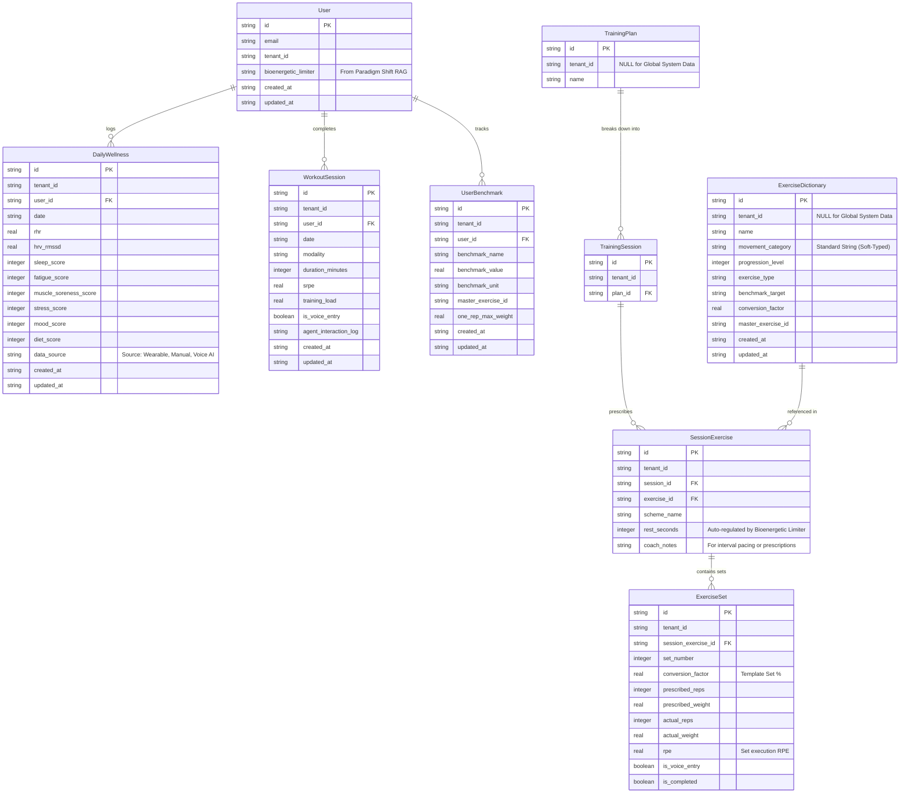

```mermaid
erDiagram
    User ||--o{ DailyWellness : "logs"
    User ||--o{ WorkoutSession : "completes"
    User ||--o{ UserBenchmark : "tracks"
    TrainingPlan ||--o{ TrainingSession : "breaks down into"
    TrainingSession ||--o{ SessionExercise : "prescribes"
    ExerciseDictionary ||--o{ SessionExercise : "referenced in"
    SessionExercise ||--o{ ExerciseSet : "contains sets"

    User {
        string id PK
        string email
        string tenant_id
        string bioenergetic_limiter "From Paradigm Shift RAG"
        string created_at
        string updated_at
    }

    DailyWellness {
        string id PK
        string tenant_id
        string user_id FK
        string date
        real rhr
        real hrv_rmssd
        integer sleep_score
        integer fatigue_score
        integer muscle_soreness_score
        integer stress_score
        integer mood_score
        integer diet_score
        string data_source "Source: Wearable, Manual, Voice AI"
        string created_at
        string updated_at
    }

    WorkoutSession {
        string id PK
        string tenant_id
        string user_id FK
        string date
        string modality
        integer duration_minutes
        real srpe
        real training_load
        boolean is_voice_entry
        string agent_interaction_log
        string created_at
        string updated_at
    }

    ExerciseDictionary {
        string id PK
        string tenant_id "NULL for Global System Data"
        string name
        string movement_category "Standard String (Soft-Typed)"
        integer progression_level
        string exercise_type
        string benchmark_target
        real conversion_factor
        string master_exercise_id
        string created_at
        string updated_at
    }

    UserBenchmark {
        string id PK
        string tenant_id
        string user_id FK
        string benchmark_name
        real benchmark_value
        string benchmark_unit
        string master_exercise_id
        real one_rep_max_weight
        string created_at
        string updated_at
    }

    TrainingPlan {
        string id PK
        string tenant_id "NULL for Global System Data"
        string name
    }

    TrainingSession {
        string id PK
        string tenant_id
        string plan_id FK
    }

    SessionExercise {
        string id PK
        string tenant_id
        string session_id FK
        string exercise_id FK
        string scheme_name
        integer rest_seconds "Auto-regulated by Bioenergetic Limiter"
        string coach_notes "For interval pacing or prescriptions"
    }

    ExerciseSet {
        string id PK
        string tenant_id
        string session_exercise_id FK
        integer set_number
        
        %% The Template Math
        real conversion_factor "Template Set %"
        
        %% The Prescription (Calculated by AI using 1RM)
        integer prescribed_reps
        real prescribed_weight
        
        %% The Execution (Logged by Athlete/Voice AI)
        integer actual_reps
        real actual_weight
        real rpe "Set execution RPE"
        boolean is_voice_entry
        boolean is_completed
    }

```