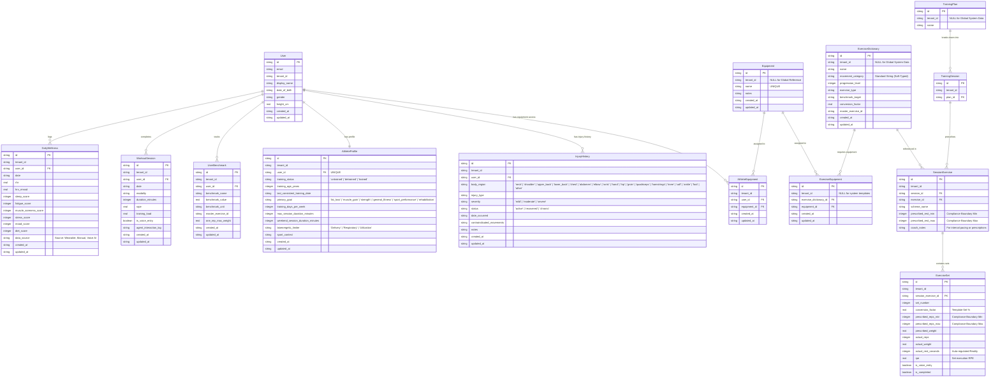

```mermaid
erDiagram
    User ||--o{ DailyWellness : "logs"
    User ||--o{ WorkoutSession : "completes"
    User ||--o{ UserBenchmark : "tracks"
    User ||--|| AthleteProfile : "has profile"
    User ||--o{ InjuryHistory : "has injury history"
    User ||--o{ AthleteEquipment : "has equipment access"
    Equipment ||--o{ AthleteEquipment : "assigned to"
    ExerciseDictionary ||--o{ ExerciseEquipment : "requires equipment"
    Equipment ||--o{ ExerciseEquipment : "assigned to"
    TrainingPlan ||--o{ TrainingSession : "breaks down into"
    TrainingSession ||--o{ SessionExercise : "prescribes"
    ExerciseDictionary ||--o{ SessionExercise : "referenced in"
    SessionExercise ||--o{ ExerciseSet : "contains sets"

    User {
        string id PK
        string email
        string tenant_id
        string display_name
        string date_of_birth
        string gender
        real height_cm
        string created_at
        string updated_at
    }

    AthleteProfile {
        string id PK
        string tenant_id
        string user_id FK "UNIQUE"
        string training_status "'untrained' | 'detrained' | 'trained'"
        integer training_age_years
        string last_consistent_training_date
        string primary_goal "'fat_loss' | 'muscle_gain' | 'strength' | 'general_fitness' | 'sport_performance' | 'rehabilitation'"
        integer training_days_per_week
        integer max_session_duration_minutes
        integer weekend_session_duration_minutes
        string bioenergetic_limiter "'Delivery' | 'Respiratory' | 'Utilization'"
        string sport_context
        string created_at
        string updated_at
    }

    InjuryHistory {
        string id PK
        string tenant_id
        string user_id FK
        string body_region "'neck' | 'shoulder' | 'upper_back' | 'lower_back' | 'chest' | 'abdomen' | 'elbow' | 'wrist' | 'hand' | 'hip' | 'groin' | 'quadriceps' | 'hamstrings' | 'knee' | 'calf' | 'ankle' | 'foot' | 'other'"
        string injury_type
        string severity "'mild' | 'moderate' | 'severe'"
        string status "'active' | 'recovered' | 'chronic'"
        string date_occurred
        string contraindicated_movements
        string notes
        string created_at
        string updated_at
    }

    Equipment {
        string id PK
        string tenant_id "NULL for Global Reference"
        string name "UNIQUE"
        string notes
        string created_at
        string updated_at
    }

    AthleteEquipment {
        string id PK
        string tenant_id
        string user_id FK
        string equipment_id FK
        string created_at
        string updated_at
    }

    ExerciseEquipment {
        string id PK
        string tenant_id "NULL for system templates"
        string exercise_dictionary_id FK
        string equipment_id FK
        string created_at
        string updated_at
    }

    DailyWellness {
        string id PK
        string tenant_id
        string user_id FK
        string date
        real rhr
        real hrv_rmssd
        integer sleep_score
        integer fatigue_score
        integer muscle_soreness_score
        integer stress_score
        integer mood_score
        integer diet_score
        string data_source "Source: Wearable, Manual, Voice AI"
        string created_at
        string updated_at
    }

    WorkoutSession {
        string id PK
        string tenant_id
        string user_id FK
        string date
        string modality
        integer duration_minutes
        real srpe
        real training_load
        boolean is_voice_entry
        string agent_interaction_log
        string created_at
        string updated_at
    }

    ExerciseDictionary {
        string id PK
        string tenant_id "NULL for Global System Data"
        string name
        string movement_category "Standard String (Soft-Typed)"
        integer progression_level
        string exercise_type
        string benchmark_target
        real conversion_factor
        string master_exercise_id
        string created_at
        string updated_at
    }

    UserBenchmark {
        string id PK
        string tenant_id
        string user_id FK
        string benchmark_name
        real benchmark_value
        string benchmark_unit
        string master_exercise_id
        real one_rep_max_weight
        string created_at
        string updated_at
    }

    TrainingPlan {
        string id PK
        string tenant_id "NULL for Global System Data"
        string name
    }

    TrainingSession {
        string id PK
        string tenant_id
        string plan_id FK
    }

    SessionExercise {
        string id PK
        string tenant_id
        string session_id FK
        string exercise_id FK
        string scheme_name
        integer prescribed_rest_min "Compliance Boundary Min"
        integer prescribed_rest_max "Compliance Boundary Max"
        string coach_notes "For interval pacing or prescriptions"
    }

    ExerciseSet {
        string id PK
        string tenant_id
        string session_exercise_id FK
        integer set_number
        
        %% The Template Math
        real conversion_factor "Template Set %"
        
        %% The Prescription (Calculated by AI using 1RM)
        integer prescribed_reps_min "Compliance Boundary Min"
        integer prescribed_reps_max "Compliance Boundary Max"
        real prescribed_weight
        
        %% The Execution (Logged by Athlete/Voice AI)
        integer actual_reps
        real actual_weight
        integer actual_rest_seconds "Auto-regulated Reality"
        real rpe "Set execution RPE"
        boolean is_voice_entry
        boolean is_completed
    }
```