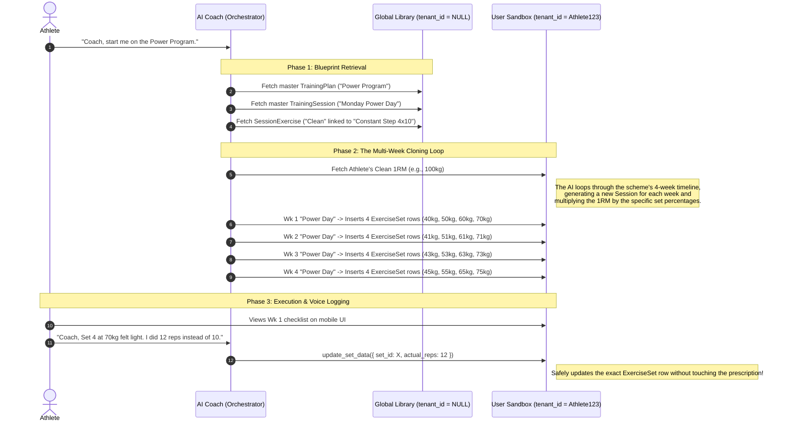

```mermaid
sequenceDiagram
    autonumber
    actor Athlete
    participant AICoach as AI Coach (Orchestrator)
    participant GlobalDB as Global Library (tenant_id = NULL)
    participant UserDB as User Sandbox (tenant_id = Athlete123)

    Athlete->>AICoach: "Coach, start me on the Power Program."
    
    rect rgb(255, 255, 255)
    Note over AICoach,GlobalDB: Phase 1: Blueprint Retrieval
    AICoach->>GlobalDB: Fetch master TrainingPlan ("Power Program")
    AICoach->>GlobalDB: Fetch master TrainingSession ("Monday Power Day")
    AICoach->>GlobalDB: Fetch SessionExercise ("Clean" linked to "Constant Step 4x10")
    end

    rect rgb(255, 255, 255)
    Note over AICoach,UserDB: Phase 2: The Multi-Week Cloning Loop
    AICoach->>UserDB: Fetch Athlete's Clean 1RM (e.g., 100kg)
    
    Note right of UserDB: The AI loops through the scheme's 4-week timeline, <br/>generating a new Session for each week and <br/>multiplying the 1RM by the specific set percentages.
    
    AICoach->>UserDB: Wk 1 "Power Day" -> Inserts 4 ExerciseSet rows (40kg, 50kg, 60kg, 70kg)
    AICoach->>UserDB: Wk 2 "Power Day" -> Inserts 4 ExerciseSet rows (41kg, 51kg, 61kg, 71kg)
    AICoach->>UserDB: Wk 3 "Power Day" -> Inserts 4 ExerciseSet rows (43kg, 53kg, 63kg, 73kg)
    AICoach->>UserDB: Wk 4 "Power Day" -> Inserts 4 ExerciseSet rows (45kg, 55kg, 65kg, 75kg)
    end

    rect rgb(255, 255, 255)
    Note over Athlete,UserDB: Phase 3: Execution & Voice Logging
    Athlete->>UserDB: Views Wk 1 checklist on mobile UI
    Athlete->>AICoach: "Coach, Set 4 at 70kg felt light. I did 12 reps instead of 10."
    AICoach->>UserDB: update_set_data({ set_id: X, actual_reps: 12 })
    Note right of UserDB: Safely updates the exact ExerciseSet row without touching the prescription!
    end
```